# System Design Interview Playbook — Common Problems

A recall reference for the 20 problems that show up most. For each: **Core** concepts to name early, an **Overview** diagram, the **Approach** (data models, numbers, concrete tech), a **Detailed** diagram, and **Probe** — the deep dives interviewers push toward. Dense by design — meant to refresh memory, not teach from scratch.

> Pairs with: [System Design Cheat Sheet](system-design-cheat-sheet.md) (numbers + scaling triggers) and [SD Tech Stacks by Problem](system-design-tech-stacks.md) (concrete tech picks + "why not the alternative"). Absorbs the detail from the older interview-questions note.
>
> Diagrams are [Mermaid](https://mermaid.js.org/) — they render in Obsidian and on GitHub. Convention: `[ ]` service · `{ }` cache/decision · `[( )]` datastore · solid arrow = sync path · dotted arrow = async.

---

## 1. URL Shortener

**Core:** unique ID generation, base62 encoding, read-heavy cache, DB unique constraint.

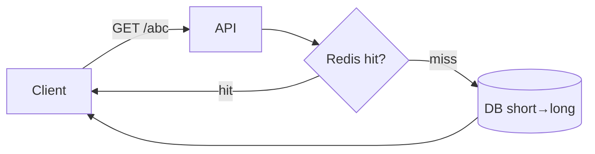

- **Encoding:** Base62 of an auto-increment ID (or Snowflake ID for multi-region). 7 chars = 62⁷ ≈ 3.5T codes. Sequential IDs are predictable (enumeration risk); hashes can collide.
- **Read-heavy (~100:1):** cache short→long in Redis; redirect path must stay fast (301 permanent vs 302 if you want to count clicks).
- **Hot keys:** a viral link hammers one cache key → replicate it across cache replicas.
- **Storage:** ~500 B/record → ~500 GB per 1B URLs. TTL to expire old entries.
- **Abuse:** rate-limit creation, block malicious redirect targets, CAPTCHA for anonymous.
- **Data model:** `short_code (PK) → long_url, created_at, expires_at, user_id`.

**Probe:** collision handling, hot links, expiration, predictable/enumerable IDs, custom aliases.

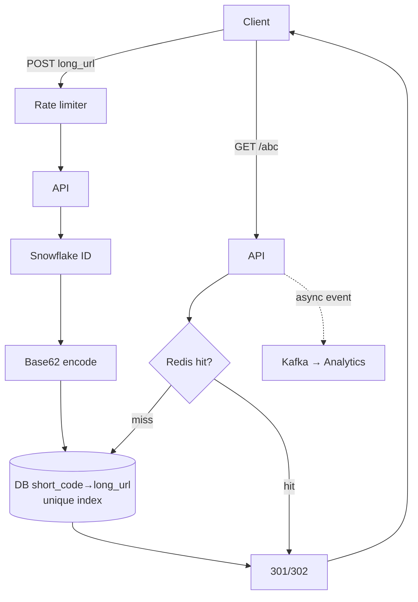

---

## 2. Twitter / News Feed

**Core:** fanout, timeline generation, celebrity problem.

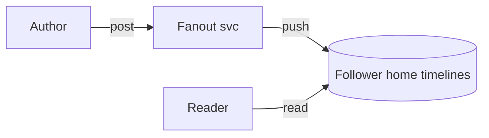

- **Fanout-on-write (push):** on post, write into every follower's home-timeline cache (Redis list). Fast reads, expensive writes for big accounts.
- **Fanout-on-read (pull):** at read time, fetch from everyone you follow and merge. Cheap writes, slow reads.
- **Hybrid (real Twitter):** push for normal users, pull for celebrities (>~10K–1M followers), merged at read.
- **Storage:** Tweet store (Cassandra-style), follower graph, home-timeline cache (Redis).
- **Ranking:** async ML on recency + engagement + affinity, not pure chronological.

**Probe:** high-follower fanout cost, timeline freshness, cursor pagination, deletes/edits, backpressure when a celebrity posts.

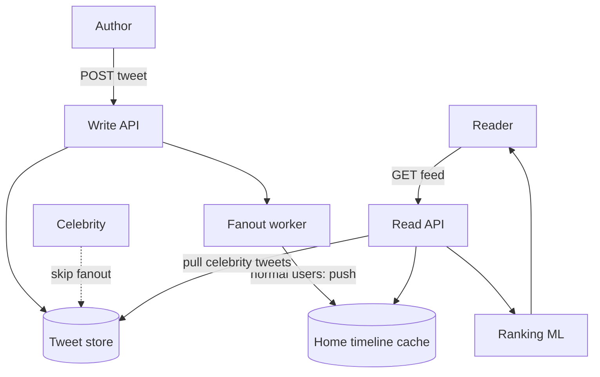

---

## 3. Instagram / Photo Sharing

**Core:** media upload pipeline, CDN, object storage, feed generation.

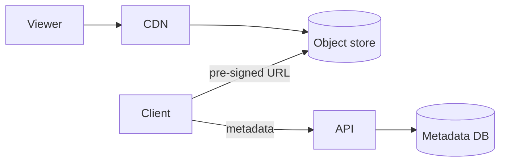

- **Upload:** client → blob storage (S3) via **pre-signed URL**, never through the app server or DB.
- **Metadata** (caption, owner, media refs) in DB; binary stays in object storage.
- **CDN** serves images/video; async workers do thumbnails, compression, moderation.
- **Feed** generated like Twitter (#2).
- **Counters** (likes/comments) sharded or in Redis to handle hot posts.

**Probe:** upload reliability/resumability, video transcoding, privacy/visibility rules, likes/comments at scale.

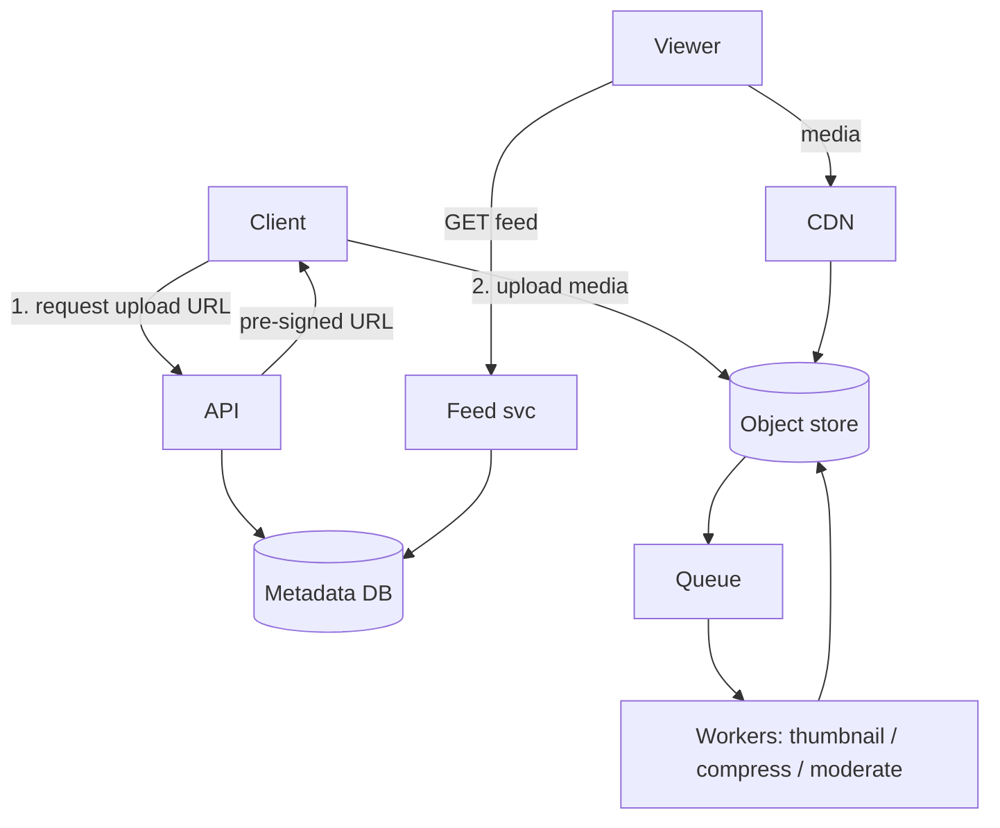

---

## 4. YouTube / Video Platform

**Core:** large resumable upload, transcoding, CDN, metadata search.

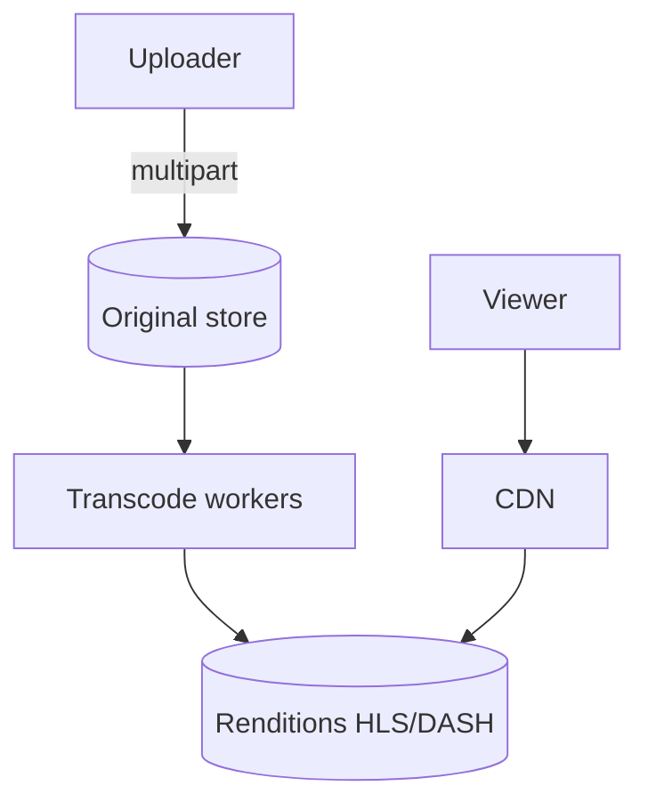

- **Upload:** multipart resumable upload of the original to object storage.
- **Transcoding:** async worker pool → multiple resolutions/codecs, segmented for **HLS/DASH** adaptive bitrate.
- **Playback:** served from CDN; player adapts bitrate to bandwidth.
- **Search:** ES/OpenSearch index on titles, descriptions, tags.

**Probe:** encoding-queue scaling, hot videos (CDN + cache), recommendations, copyright/moderation (Content-ID style fingerprinting).

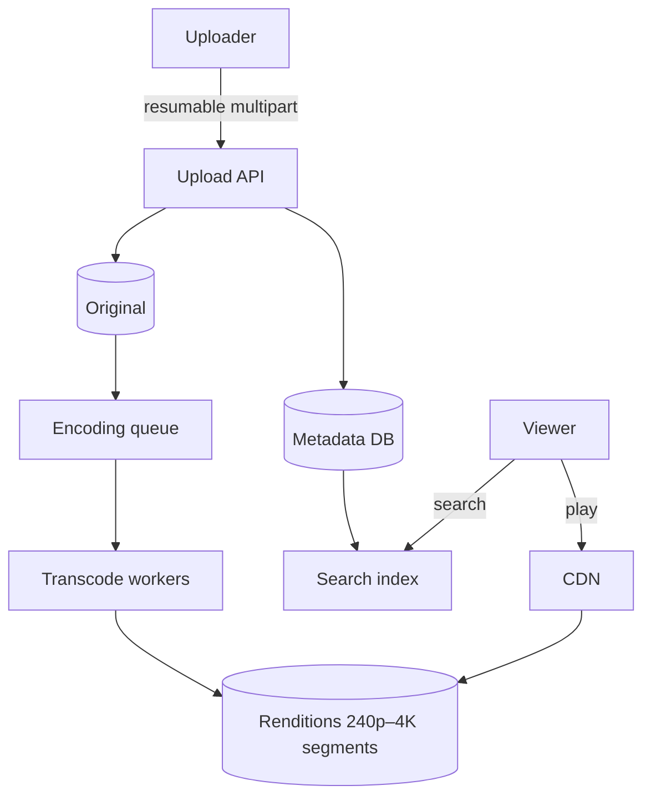

---

## 5. Chat / Messenger (1:1)

**Core:** real-time delivery, message persistence, online/offline state.

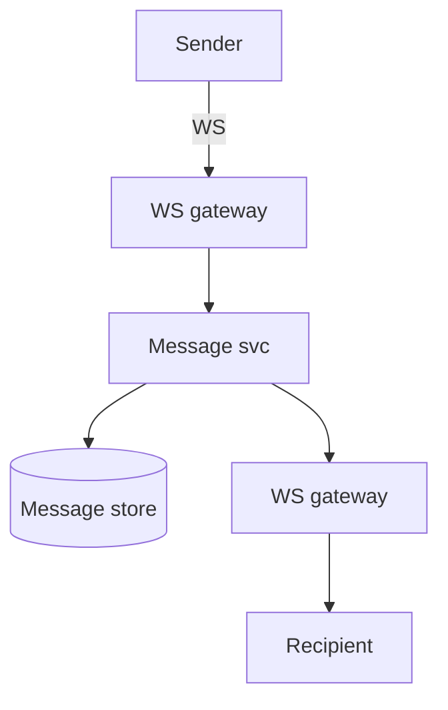

- **Transport:** WebSocket gateways with a connection registry; fall back to long-polling on restrictive networks.
- **Persist before deliver:** message service writes to store (Cassandra, sharded by `conversation_id`) then fans out.
- **Ordering:** per-conversation sequence number or server timestamp — strict within a conversation.
- **Offline:** per-user inbox holds undelivered messages; deliver on reconnect via a cursor; push notification for offline users.
- **Read receipts:** track `last_read_message_id` per user per conversation (lightweight updates, not full messages).

**Probe:** ordering, retries/dedupe, read receipts, multi-device sync (per-device cursor), offline delivery.

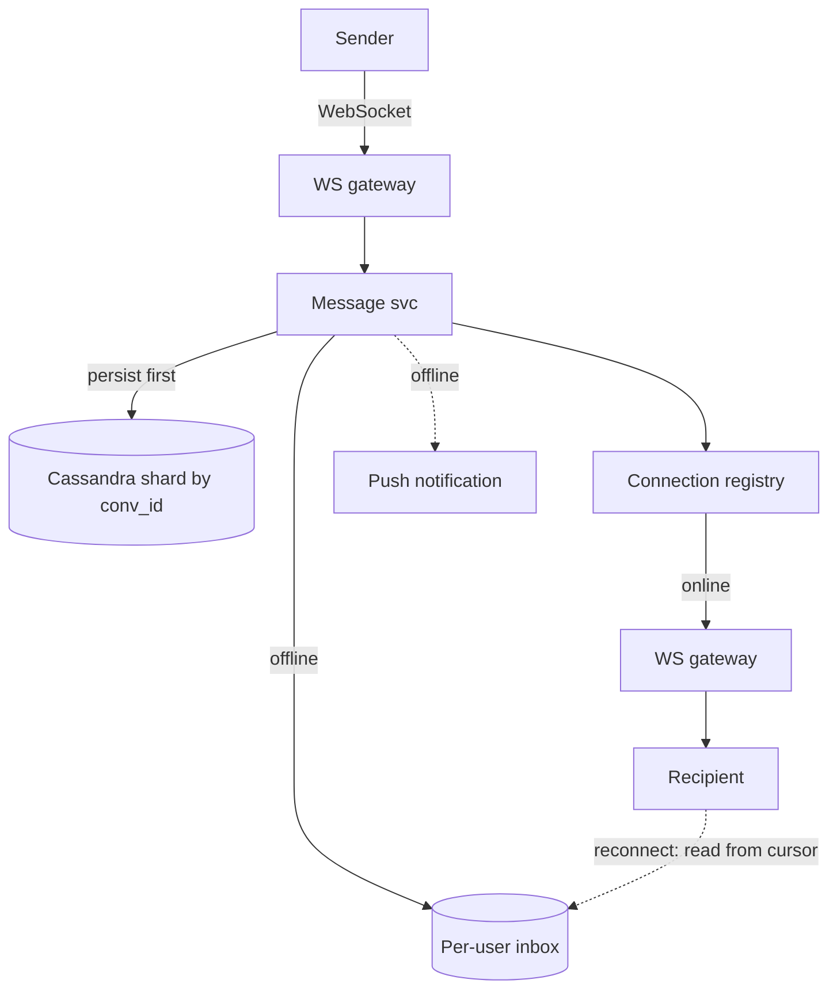

---

## 6. WhatsApp / Group Chat

**Core:** group fanout, delivery state, end-to-end encryption.

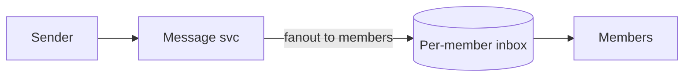

- **Small groups:** fanout the message to every member's inbox. **Huge channels:** pub-sub or read-based fetch instead.
- **Delivery/read state** stored separately per recipient.
- **Sequence number per group** for ordering.
- **E2E encryption:** server stores ciphertext only; key exchange via Signal protocol, sender keys for groups.

**Probe:** exactly-once illusion via dedupe ID, group membership changes, encryption metadata, large-group fanout cost.

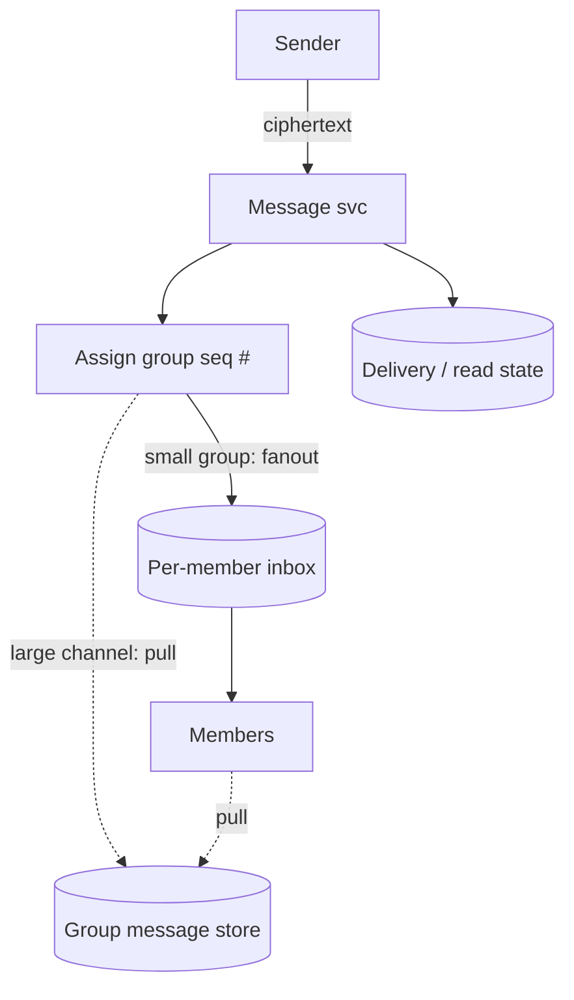

---

## 7. Uber / Ride Matching

**Core:** geospatial indexing, matching, real-time location updates.

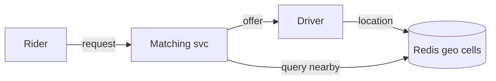

- **Driver locations** in Redis keyed by **geohash / S2 / H3** cell, refreshed every few seconds.
- **Request:** query rider's cell + neighbor cells for candidate drivers.
- **Matching service** locks a candidate (prevents double-assign), sends an offer with a timeout.
- **State machine:** requested → matched → accepted → in_progress → complete.
- **Location updates** flow through an event stream (Kafka).

**Probe:** race conditions (two riders, one driver), surge pricing, ETA computation, cancellations, cell-boundary edge cases.

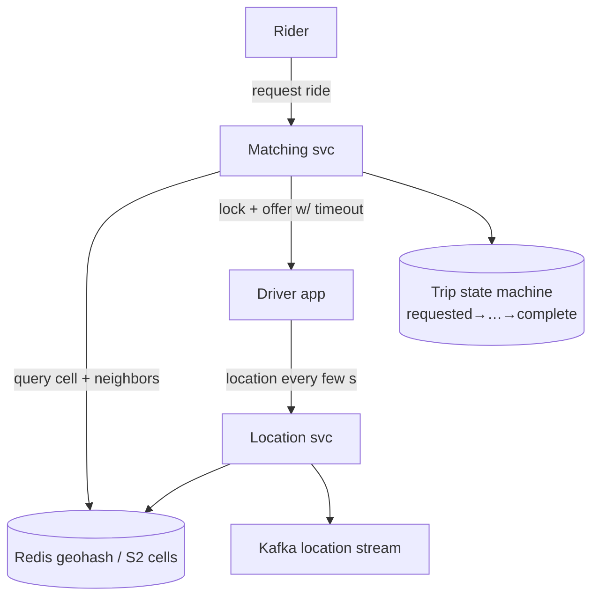

---

## 8. Google Maps / Nearby Search

**Core:** geospatial index, tiling, precomputation.

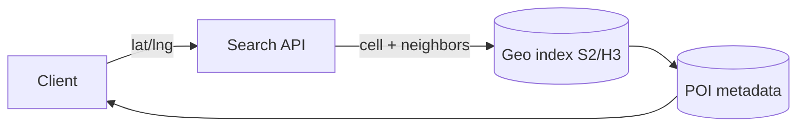

- **Cells:** geohash / S2 / H3; query current cell + neighbors, expand radius if too few results.
- **POI metadata** in DB / search index; cache popular areas; map tiles precomputed and served from CDN.
- **Routing** (if asked): road graph + Dijkstra/A*, precomputed contraction hierarchies for speed.

**Probe:** ranking nearby places, radius expansion, stale location data, tile precompute cost.

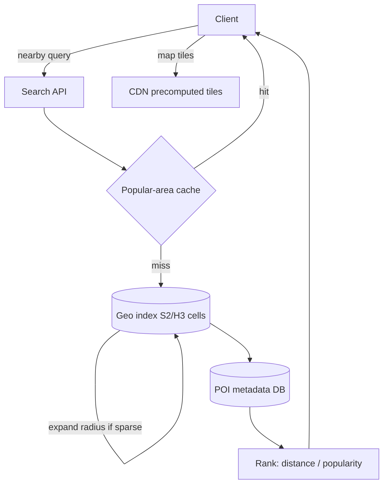

---

## 9. Yelp / Restaurant Search

**Core:** search index, geo filtering, ranking.

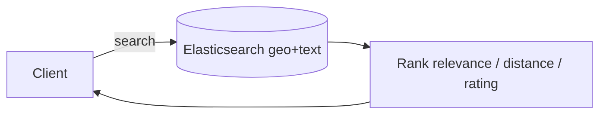

- **Source of truth:** Postgres/MySQL. **Search:** Elasticsearch/OpenSearch with `geo_distance` filter.
- **Ranking:** relevance + distance + rating + popularity.
- **Reviews** stored separately; aggregate rating denormalized/cached.
- **Autocomplete** via a separate prefix index (#14).

**Probe:** DB↔index sync (denormalization), review spam, eventual consistency, autocomplete latency.

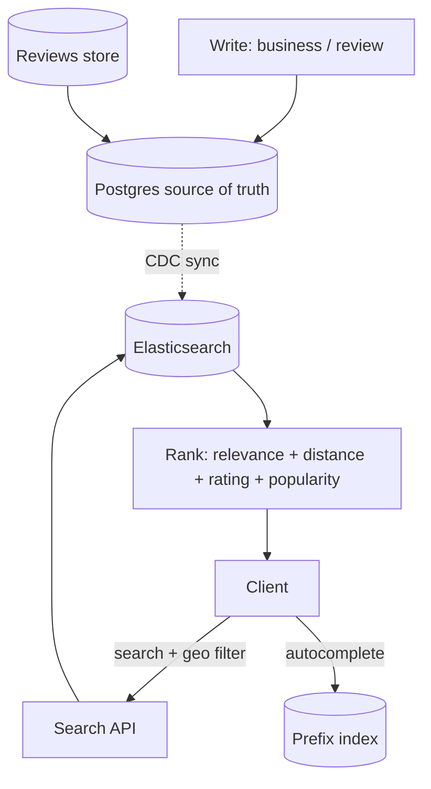

---

## 10. Google Drive / Dropbox

**Core:** chunked file storage, metadata, sync, versioning.

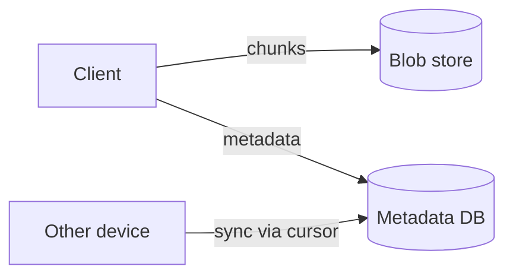

- **Chunking:** split files into ~4 MB chunks; store in blob storage; **content hash per chunk → dedupe** (content-addressable).
- **Metadata DB:** files/folders/permissions/chunk list/versions, separate from blobs.
- **Reliable upload:** multipart + parallel chunks, resume on failure; SHA-256 checksum to detect corruption.
- **Sync:** service watches changes; client keeps a cursor/journal and syncs only changed chunks (delta sync).
- **Durability:** replicate across AZs, erasure coding (S3-style 11 nines). Pre-signed URLs for access.

**Probe:** conflict resolution (concurrent edits), sharing permissions, folder moves/renames, offline sync.

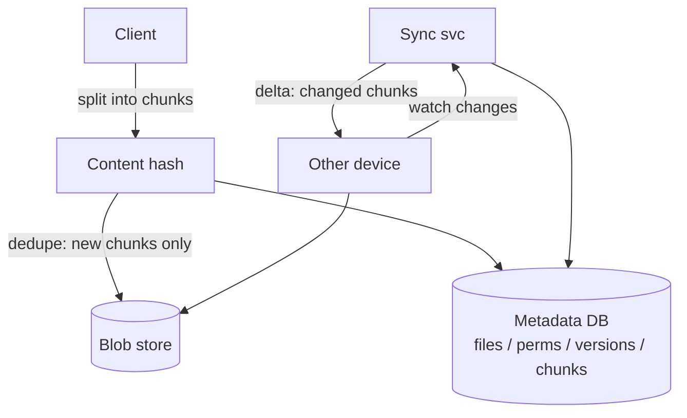

---

## 11. Distributed Job Scheduler

**Core:** durable schedule store, due queue, workers, idempotency.

```mermaid
flowchart LR
    SDB[(Schedule DB)] --> DQ[Due queue Redis ZSET]
    DQ --> W[Workers lease]
    W --> EX[(Execution status)]
```

- **Schedule DB = source of truth** (`next_run_at`).
- **Due queue:** push due jobs into a Redis sorted set (score = run time) or delay queue.
- **Workers** claim jobs with a **lease / visibility timeout**; renew for long jobs; an execution table tracks status.
- **At-least-once + idempotent** jobs (dedupe by execution ID).
- **Reconciler** scans for missed or stuck jobs (crashed worker, expired lease).

**Probe:** recurring/cron jobs, retries + backoff + DLQ, clock skew, worker crashes, duplicate execution.

```mermaid
flowchart TD
    API[Create job] --> SDB[(Schedule DB next_run_at)]
    SDB --> POLL[Poller]
    POLL --> DQ[Due queue Redis sorted set]
    DQ --> W[Workers claim w/ lease]
    W --> EX[(Execution table)]
    W -->|fail| RET[Retry + backoff]
    RET -->|max retries| DLQ[(DLQ)]
    REC[Reconciler] -->|scan stuck / missed| SDB
    REC --> DQ
```

---

## 12. Rate Limiter

**Core:** token bucket, sliding window, distributed counters.

```mermaid
flowchart LR
    C[Client] --> GW[API gateway]
    GW --> R{Redis token bucket}
    R -->|allow| SVC[Service]
    R -->|exceed| X[429]
```

- **Token bucket:** tokens refill at a fixed rate, each request costs one, bursts allowed up to capacity. Most common.
- **Leaky bucket:** fixed-rate queue — smooths bursts, adds latency.
- **Sliding window** (log or counter): more precise than fixed window, more memory (Redis sorted set, score = timestamp).
- **Distributed:** Redis `INCR`+`EXPIRE`, or a **Lua script** for atomic check-and-increment shared across gateways. Local cache for very hot keys.
- **Key** by user / IP / API key; return **429 + Retry-After**.

**Probe:** fixed-window burst at boundaries, Redis failure (fail-open vs fail-closed), multi-region limits, NAT (many users per IP).

```mermaid
flowchart TD
    C[Client] --> GW[API gateway]
    GW --> LC{Local cache hot key}
    LC -->|allow| SVC[Service]
    LC -->|check| LUA[Redis Lua: atomic check + incr]
    LUA -->|tokens left| SVC
    LUA -->|empty| X[429 + Retry-After]
    LUA --> RDS[(Redis shared counters)]
```

---

## 13. Notification System

**Core:** fanout, preference filtering, multi-channel delivery.

```mermaid
flowchart TD
    E[Event] --> NS[Notification svc]
    NS --> Q[Channel queues]
    Q --> W[Workers] --> P[Email / SMS / Push]
```

- **Flow:** event producer emits intent → notification service checks prefs/opt-outs/quiet hours → enqueue.
- **Queue per channel** (email/SMS/push); **priority queues** (OTP/security vs marketing).
- **Workers** send with retries + exponential backoff; **provider abstraction** with failover (e.g., Twilio → Vonage).
- **Idempotency:** dedupe key (`notification_id` + recipient); at-least-once delivery.
- **DLQ** after N retries for manual inspection.

**Probe:** rate limits, provider failures, digest/batching, delivery guarantees (exactly-once is impractical).

```mermaid
flowchart TD
    E[Event producer] -->|intent| NS[Notification svc]
    NS --> PREF{Prefs / opt-out / quiet hours}
    PREF -->|suppress| DROP[Dropped]
    PREF -->|dedupe key| QE[Email queue]
    PREF --> QS[SMS queue]
    PREF --> QP[Push queue priority]
    QE --> W[Workers retry + backoff]
    W --> PROV[Provider + failover]
    W -->|fail N×| DLQ[(DLQ)]
```

---

## 14. Search Autocomplete

**Core:** prefix search, ranking, low latency.

```mermaid
flowchart LR
    C[Client] -->|prefix| API[Autocomplete API]
    API --> T[(Trie / prefix table)]
    T -->|top-k| C
```

- **Trie** is the conceptual answer, with top-k suggestions cached at each node. In practice: precomputed prefix→suggestions table or an ES completion suggester.
- **Cache** popular prefixes; **rank** by popularity + personalization.
- **Async update** from query logs (rebuild counts/trie periodically).

**Probe:** typo tolerance (edit distance), freshness vs rebuild cost, i18n, memory usage, sub-100 ms latency.

```mermaid
flowchart TD
    C[Client] -->|prefix keystroke| API[Autocomplete API]
    API --> Cache{Popular-prefix cache}
    Cache -->|hit| C
    Cache -->|miss| T[(Trie / prefix→top-k table)]
    T --> C
    LOG[Query logs] --> AGG[Async aggregation]
    AGG -->|rebuild counts| T
```

---

## 15. Web Crawler

**Core:** URL frontier, dedupe, politeness, parsing.

```mermaid
flowchart LR
    F[URL frontier] --> Fetch[Fetcher]
    Fetch --> P[Parser]
    P -->|new links| F
    P --> STORE[(Pages + index)]
```

- **Frontier:** priority queue of URLs to crawl; normalize + hash, with a **Bloom filter** for seen-URL dedupe.
- **Politeness:** per-domain rate limiting; respect `robots.txt`; cache DNS.
- **Pipeline:** fetcher workers → parser extracts links/content → store raw pages (S3) + indexed content. Partition frontier by domain.

**Probe:** robots.txt, infinite/spider traps, priority crawling, recrawl frequency, Bloom-filter false positives.

```mermaid
flowchart TD
    SEED[Seed URLs] --> F[URL frontier priority queue]
    F --> POL{Per-domain rate limit + robots.txt}
    POL --> Fetch[Fetcher workers]
    Fetch --> P[Parser]
    P --> DEDUP{Seen? Bloom filter}
    DEDUP -->|new| F
    DEDUP -->|dup| DROP[Discard]
    P --> RAW[(Raw pages S3)]
    P --> IDX[(Index)]
```

---

## 16. Ticketmaster / Seat Booking

**Core:** inventory locking, expiration, payment flow.

```mermaid
flowchart LR
    U[User] -->|select seat| BK[Booking svc]
    BK -->|hold w/ TTL| INV[(Seat inventory)]
    BK -->|pay| PAY[Payment]
    PAY -->|success| INV
```

- **Hold:** temporary seat hold with TTL (~10 min) under **strong consistency** (`SELECT ... FOR UPDATE` or atomic status flip) — prevents double booking.
- **Payment** runs async while the seat stays held; **confirm** on success, **release** on timeout/failure.
- **Flash sales:** virtual **waiting room / queue** admits users gradually to protect inventory.

**Probe:** double booking under concurrency, flash-sale thundering herd, idempotent payment, hold-expiry reconciliation.

```mermaid
flowchart TD
    U[User] --> WRm{Waiting room / virtual queue}
    WRm -->|admitted| BK[Booking svc]
    BK -->|hold TTL, row lock| INV[(Seat inventory strong consistency)]
    BK --> PAY[Payment async]
    PAY -->|success| CONF[Confirm booking]
    CONF --> INV
    PAY -.->|timeout / fail| REL[Release hold]
    REL --> INV
```

---

## 17. Ecommerce / Amazon Checkout

**Core:** catalog search, cart, inventory reservation, orders.

```mermaid
flowchart LR
    C[Client] -->|checkout + idempotency key| ORD[Order svc]
    ORD -->|reserve| INV[(Inventory)]
    ORD --> PAY[Payment]
    PAY -->|ok| ORD
```

- **Catalog** DB + search index (ES); **cart** in Redis/DB.
- **Idempotency key** on checkout → prevents double-charge on retry.
- **Inventory reservation:** soft lock + TTL at checkout; **strong consistency** to avoid overselling (display counts can be eventual).
- **Order state machine:** CREATED → PENDING_PAYMENT → PAID → FULFILLING → SHIPPED → DELIVERED (+ CANCELLED/REFUNDED).
- **Saga:** order → reserve inventory → charge → confirm; **compensate** (release inventory) on failure.

**Probe:** overselling, payment retries, order idempotency, consistency tradeoff (eventual for display, strong at checkout).

```mermaid
flowchart TD
    C[Client] -->|search| ES[(Catalog index)]
    C -->|cart| CART[(Redis cart)]
    C -->|checkout + idempotency key| ORD[Order svc / saga]
    ORD --> INV[(Inventory reserve: soft-lock TTL)]
    ORD --> PAY[Payment]
    PAY -->|success| CONF[Order confirmed]
    PAY -.->|fail: compensate| REL[Release inventory]
    CONF --> EV[Events → fulfillment / shipping]
```

---

## 18. Payment System

**Core:** ledger, idempotency, state machine, auditability.

```mermaid
flowchart LR
    C[Client] -->|idempotency key| PS[Payment svc]
    PS --> LED[(Immutable ledger)]
    PS --> PROV[Provider]
    PROV --> PS
```

- **Immutable double-entry ledger** — never mutate balances without a ledger record.
- **Idempotency key** per payment request → retries don't double-charge.
- **States:** initiated → authorized → captured → settled / failed / refunded.
- **Transactional outbox** for events; **reconciliation jobs** against the provider.

**Probe:** double-charge prevention, retries, external provider failures/timeouts, refunds, exactly-once.

> Full deep dive: [Payment System Design](payment-system-design.md).

```mermaid
flowchart TD
    C[Client] -->|request + idempotency key| PS[Payment svc]
    PS --> IDEM{Seen key?}
    IDEM -->|yes| RET[Return prior result]
    IDEM -->|no| SM[State machine<br/>initiated→authorized→captured→settled]
    SM --> LED[(Double-entry ledger immutable)]
    SM --> PROV[External provider]
    SM --> OUT[Transactional outbox]
    OUT --> EV[Events]
    REC[Reconciliation job] --> LED
    REC --> PROV
```

---

## 19. Metrics / Logging / Tracing

**Core:** high-write ingestion, aggregation, retention, low query latency.

```mermaid
flowchart TD
    AG[Agents] --> K[Kafka buffer]
    K --> SP[Stream processors]
    SP --> TS[(Time-series DB)]
    TS --> Q[Query / dashboards]
```

- **Ingestion:** agents emit metrics/logs → **Kafka/Kinesis** buffer → stream processors aggregate. Batch writes downstream.
- **Metrics store:** time-series DB (Prometheus/InfluxDB/TimescaleDB), columnar + compression. Pre-aggregate at 1m/5m/1h/1d.
- **Logs/traces:** Elasticsearch for search; archive to S3. Propagate **correlation/trace IDs** via headers; **sample** 1–5% (head- or tail-based).
- **Retention:** hot recent + cold archive; **downsample** old data (raw 7d → 1m 30d → 1h 1y).

**Probe:** cardinality explosion (high-card labels), backpressure, query latency (rollups, HyperLogLog), data-loss tolerance, cost.

```mermaid
flowchart TD
    AG[Agents metrics + logs] --> K[Kafka / Kinesis buffer]
    K --> SP[Stream processors aggregate]
    SP --> HOT[(Hot: TSDB recent)]
    SP --> ES[(Elasticsearch logs / traces)]
    HOT -->|downsample| COLD[(Cold archive S3)]
    Q[Dashboards / queries] --> HOT
    Q --> ES
    AG -.->|sample 1-5% + trace IDs| K
```

---

## 20. Distributed Cache

**Core:** cache-aside, TTL, eviction, consistency.

```mermaid
flowchart LR
    APP[App] --> C{Cache hit?}
    C -->|hit| APP
    C -->|miss| DB[(DB)]
    DB --> C
```

- **Cache-aside:** app checks cache; on miss read DB and populate; TTL prevents stale-forever.
- **Eviction:** LRU/LFU. **Sharding** via consistent hashing (minimizes remap when nodes change).
- **Write strategies:** write-through (consistent, slower), write-around (avoids polluting cache with rarely-read data), write-back (fast, risk of loss).

**Probe:** cache stampede (locking / request coalescing / early refresh), hot keys (replicate), invalidation, thundering herd on cold start.

```mermaid
flowchart TD
    APP[App] --> CH[Consistent hashing ring]
    CH --> C{Cache hit?}
    C -->|hit| APP
    C -->|miss + lock| DB[(DB)]
    DB --> POP[Populate + TTL]
    POP --> APP
    C -.->|stampede: single-flight lock| DB
    EVICT[LRU / LFU eviction] --> C
```

---

## Cross-Cutting Concepts to Weave In

**Scaling:** horizontal scaling · stateless services · load balancers · partitioning/sharding · replication · caching · async queues.

**Reliability:** retries with exponential backoff · idempotency keys · dead-letter queues · timeouts · circuit breakers · health checks · reconciliation jobs.

**Consistency:** strong for money/inventory/bookings; eventual for feeds/likes/analytics/search. Transactions where correctness matters, async events where latency matters.

**Storage choices:**

| Need | Reach for |
|---|---|
| Transactions, relational data, bookings/payments | **SQL** (Postgres/MySQL) |
| High-scale key-value / document | **NoSQL** (Cassandra/DynamoDB) |
| Cache, counters, sorted sets, ephemeral state | **Redis** |
| Durable event stream | **Kafka** |
| Search / autocomplete | **Elasticsearch** |
| Images, video, files | **Object storage** (S3) |

**Go-to interview phrases:**

- "The database is the source of truth."
- "This path is read-heavy, so I'd add cache/CDN."
- "This can be eventually consistent."
- "We need idempotency because retries can duplicate requests."
- "Use async processing so the user-facing path stays low latency."
- "Use leases so crashed workers don't permanently own work."
- "Use a reconciler to repair missed events or stuck states."

---

## What Interviewers Evaluate (Amazon's 5 dimensions)

1. **Requirements clarity** — you ask good questions before drawing anything.
2. **Tradeoffs** — CAP, cost, latency, correctness; you justify why one approach over another.
3. **Failure thinking** — timeouts, retries, partial failures, backpressure.
4. **Data model + APIs** — actual schema and endpoints, not just boxes and arrows.
5. **"How would you run this in prod?"** — metrics, alerts, rollbacks, migrations.

_Source for the question set and evaluation dimensions: [@0xlelouch_](https://x.com/0xlelouch_/status/2023272048395788589)._
</content>
</invoke>
